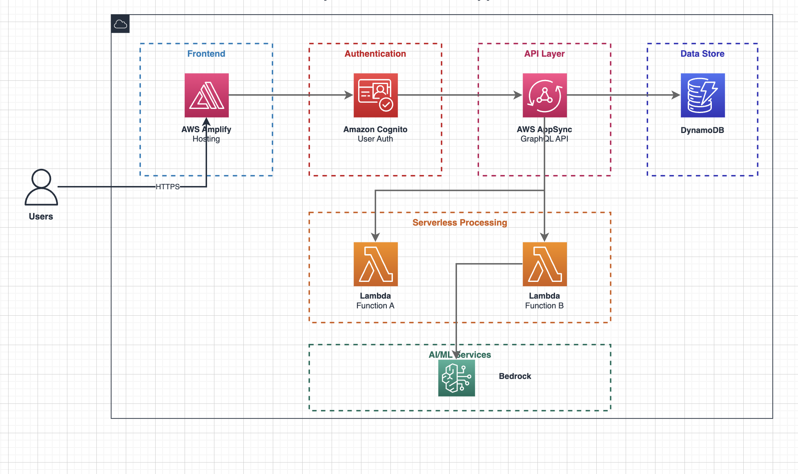

# AWS Architecture Diagram Skill

Claude Code用のカスタムスキル。draw.io MCPを使用してAWS公式アイコンスタイルのシステム構成図を自動生成します。

## サンプル出力



## 必要なもの

- [Claude Code](https://claude.ai/claude-code)
- draw.io MCP

## インストール

### 1. draw.io MCPを設定

#### 方法A: CLIコマンドでグローバル登録（推奨）

すべてのプロジェクトで使いたい場合:

```bash
claude mcp add drawio -- npx -y @drawio/mcp
```

#### 方法B: プロジェクト単位で設定

プロジェクトの `.mcp.json` に以下を追加:

```json
{
  "mcpServers": {
    "drawio": {
      "command": "npx",
      "args": ["-y", "@drawio/mcp"]
    }
  }
}
```

### 2. スキルをインストール

#### 方法A: グローバルインストール（全プロジェクトで使用）

```bash
mkdir -p ~/.claude/skills
cp SKILL.md ~/.claude/skills/aws-architecture-diagram.md
```

#### 方法B: プロジェクト単位でインストール

```bash
mkdir -p .claude/skills
cp SKILL.md .claude/skills/aws-architecture-diagram.md
```

## 使い方

Claude Codeで以下のように依頼:

```
システム構成図を書いて
```

または

```
/aws-architecture-diagram
```

## 特徴

- AWS公式アイコン（mxgraph.aws4）を使用
- サービスごとに適切な色分け
- グループボックスで論理的に整理
- draw.ioで編集・エクスポート可能

## サポートするAWSサービス

| サービス | アイコン名 | 色 |
|----------|-----------|-----|
| Cognito | cognito | 赤 |
| AppSync | appsync | ピンク |
| Amplify | amplify | ピンク |
| DynamoDB | dynamodb | 青 |
| Lambda | lambda | オレンジ |
| Translate | translate | 緑 |
| Bedrock | bedrock | 緑 |
| S3 | s3 | 緑 |
| CloudFront | cloudfront | 紫 |
| API Gateway | api_gateway | ピンク |

## ファイル構成

```
aws-architecture-diagram-skill/
├── README.md        # このファイル
├── SKILL.md         # スキル本体
└── template.xml     # draw.io XMLテンプレート
```

## カスタマイズ

`template.xml` を参考に、独自のレイアウトやサービスを追加できます。

## ライセンス

MIT

## 作者

Created with Claude Code
